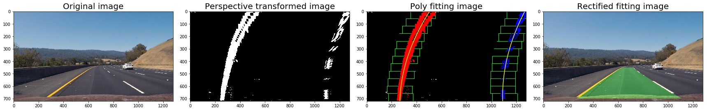

## CarND-Advanced-Lane-Lines

### Goals and steps

* Compute the camera calibration matrix and distortion coefficients given a set of chessboard images.
* Apply a distortion correction to raw images.
* Use color transforms, gradients, etc., to create a thresholded binary image.
* Apply a perspective transform to rectify binary image ("birds-eye view").
* Detect lane pixels and fit to find the lane boundary.
* Determine the curvature of the lane and vehicle position with respect to center.
* Warp the detected lane boundaries back onto the original image.
* Output visual display of the lane boundaries and numerical estimation of lane curvature and vehicle position.

## [Rubric](https://review.udacity.com/#!/rubrics/571/view) Points

### Here I will consider the rubric points individually and describe how I addressed each point in my implementation.  

---

### data and files

- camera_cal is the images need to be calibrated
- input test image directory is `test_images`, it also contains images for my debugging
- output of test images is `output_images`, it contains undistortion result images, combined thresholding result images and perspective transformed result images
- code file for camera calibration is `Camera Calibration.ipynb`
- code file for Pipeline of images is `Pipeline (test images).ipynb`
- code file for Pipeline of video is `Pipeline (video).ipynb`
- writeup file is `writeup.md`


### Camera Calibration

#### 1. Briefly state how you computed the camera matrix and distortion coefficients. Provide an example of a distortion corrected calibration image.

The code for this step is contained in the first code cell of the IPython notebook located in `./Camera Calibration.ipynb`

The pipeline of camera calibration is shown as below:

- pick a distortured image to be done, here I pick `.camera_cal/calibration1.jpg`
- load the image and set the corners of x/y, here I set 9/5
- prepare the object points
- convert original image into a gray one
- find positions of chessboard corners with function `cv2.findChessboardCorners`
- collect the corners if found
- compute the distortion calibration matrix and distortion coefficients with function `cv2.calibrateCamera` and positions of corners and object points, and undistort this image with funcion `cv2.undistort` and calibration matrix and distortion coefficients

Updated 1(by 06/01/2018): 

My code on this still on `./Camera Calibration.ipynb` file.

This script is a example of calibration on image `calibration1` since it is the most notable distortured image while the other images in `camera_cal` directory seem need to be perspective transformed. The script `Pipeline (test images)` *had already* tried to fix all of these images with function `undistortion`, but it seems not working well on all of these image in `camera_cal` folder, *remember checking that script*. I might need more specific suggestions about that.


### Pipeline (single images)

#### 1. Provide an example of a distortion-corrected image.

I take the calibration1.jpg as a example to demonstrate distortion-corrected image:


Updated 1(by 06/01/2018): 

My code on this still on `Pipeline (test images).ipynb` file.

The script `Pipeline (test images).ipynb` *had already* tried to fix all of these images with function `undistortion`, but it seems not working well on all of these image in `camera_cal` folder, *remember checking that script*. I might need more specific suggestions about that.


Updated 2(by 06/07/2018):

My code on this still on `Pipeline (test images).ipynb` file.

It seems like I have not cleared my doubt or not having the previous reviewers got it. So, I am detailing my steps of trials in the below:
1. Initially I chose the `test_images` as my input folder, unfortunately the `findChessboardCorners` returned false, it seemed *normal* on the driving images, not need to be undistortured.
2. I chose the `camera_cal` as my input folder, lucklily I got have one image `calibration1.jpg` undistortured, while the others still seemed normal. So I put the succeeded one on the above.

So, I can not seem what's the *point* of this step(undistorture on these images), am I missing something else? We have learned how to find corners on chess board, but could it be applied on other distortured images? Still confusing...

#### 2. Describe how (and identify where in your code) you used color transforms, gradients or other methods to create a thresholded binary image.  Provide an example of a binary image result.

I used a combination of gradient, S, and R channel thresholds to generate a binary image with function `Threasolding` in code file `./Pipeline (test images).ipynb`.  Here's an example of my output for this step:


#### 3. Describe how (and identify where in your code) you performed a perspective transform and provide an example of a transformed image.

The steps of perspective transformation are shown as below:

- define offset of object points, here 200 is good enough for me
- define the four source points of trapeziod in original image, `(600, 450), (700, 450), (200, 700), (1100, 700)` is my setting
- define the four target points of rectangle, I set them based on the offset 200
- compute perspective transformation matrix with funcion `cv2.getPerspectiveTransform` and src/dst points
- perspective transformation with function `cv2.warpPerspective` and transformation matrix

```python
    ## src
    src_left_top = (600, 450)
    src_right_top = (700, 450)
    src_left_bottom = (200, 700)
    src_right_bottom = (1100, 700)
    ## dst
    dst_left_top = (offset, 0)
    dst_right_top = (img_size[0] - offset, 0)
    dst_right_bottom = (img_size[0]-offset, img_size[1])
    dst_left_bottom = (offset, img_size[1])
```

The example of transformed image is shown as below:


#### 4. Describe how (and identify where in your code) you identified lane-line pixels and fit their positions with a polynomial?

I found the lane lines with the K sliding rectangles in function `PolyFitting` of code file `./Pipeline (test images).ipynb`, the steps of it are shown as below:
- initial the x-center of the first rectangle with peak of the left/right halves of the histogram
- confirm the area of the first rectangle with margin and window height
- collect the indices of lane line pixels within the first rectangle area
- re-center the x-center of the next rectangle and go into the next iteration
- concate all the indices of the lane line pixels of rectangles, extract left and right line pixel positions
- fitting the lane lines with second order polynomial
 
I did not save the output of poly-fitting image, but you can see a example of it after running the jupyter script `./Pipeline (test images).ipynb`.

#### 5. Describe how (and identify where in your code) you calculated the radius of curvature of the lane and the position of the vehicle with respect to center.

I did this in the last few lines of function `PolyFitting` within code file `./Pipeline (test images).ipynb`

#### 6. Provide an example image of your result plotted back down onto the road such that the lane area is identified clearly.

I implemented this step in lines # through # in function `PolyFitting` within code file `./Pipeline (test images).ipynb`.  

The example image of clearly identified one is shown as below:



Update:

For the problem of position of vehicle, I had mistaken the direction of it, and I have already fixed it. I am also wondering if the car is on the left of the center in the whole `project_video.mp4` video.

----

### Pipeline (video)

#### 1. Provide a link to your final video output.  Your pipeline should perform reasonably well on the entire project video (wobbly lines are ok but no catastrophic failures that would cause the car to drive off the road!).

My code of finding lane lines of video is `./Pipeline (video).ipynb` with thorough comments of each step.

Here's a [marked lane in the project video](output_video/project_video.mp4)

---

### Discussion

#### 1. Briefly discuss any problems / issues you faced in your implementation of this project.  Where will your pipeline likely fail?  What could you do to make it more robust?

Issues during completing this `project_video.mp4`:

I failed once due to the invalid parameter *offset*(initially with 300) in perspective transformation resulting in the failure of finding the left lane line, and it flashed a few seconds. I captured a few of the flawed frames, specifically within 22s, 23s, 40s in timeline with PhotoShop software and saved them in my test_image directory. And tried to change the magnitude of the offset, it worked and flashing disappeared after I set it 200.

Udate:

I tried on the other two videos, it seems works badly, for the `challenge_video.mp4`, I think I need adding more strategies on thresholding besides gray gradient, R/S channel, to improve the quality of left lane line, and I am working on it.
