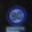
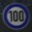
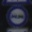
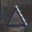
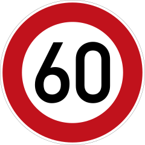
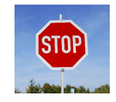
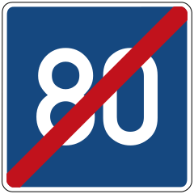

# **Traffic Sign Recognition** 

## The goal and steps
The goal of this project is to maximum the performance of classification for traffic sign.

The steps of this project are the following:
* Load the data set
* Explore, summarize and visualize the data set
* Design, train and test a model architecture
* Use the model to make predictions on new images
* Analyze the results of these predictions in detail and find ways to boost the performance of classification
* Re-train the model in a improved way and predict on the test sets, see what happens
* Summarize the results with a written report


## Rubric Points

Here I will consider the [rubric points](https://review.udacity.com/#!/rubrics/481/view) individually and describe how I addressed each point in my implementation,  and here is a link to my [project code](https://github.com/PayneJoe/SDC/blob/master/CarND-Traffic-Sign-Classifier-Project/Traffic_Sign_Classifier.ipynb)

---

### Data Set Summary & Exploration

#### 1.  basic summary of the data set

I used the pandas library to calculate summary statistics of the traffic
signs data set:

* The size of training set is 34799
* The size of the validation set is 4410
* The size of test set is 12630
* The shape of a traffic sign image is (32, 32, 3)
* The number of unique classes/labels in the data set is 43

I just calculated the propotions of individual labels, and did not visualize them yet. The propotions are show below:

```
[ 0.00517256  0.05689819  0.05776028  0.03620794  0.05086353  0.04741516
  0.01034512  0.03707003  0.03620794  0.03793212  0.05172562  0.03362166
  0.05431191  0.055174    0.01982816  0.01551769  0.01034512  0.02844909
  0.03103537  0.00517256  0.00862094  0.00775884  0.00948303  0.01293141
  0.00689675  0.03879422  0.01551769  0.00603466  0.0137935   0.00689675
  0.01120722  0.01982816  0.00603466  0.01721314  0.01034512  0.03103537
  0.00948303  0.00517256  0.05344981  0.00775884  0.00862094  0.00603466
  0.00603466]
```

It seems like they differs much in some way.

#### 2. Visualization for few images from train






### Preprocessing for images

#### Analysis for initial results
First of all, I tried to train the **RAW** data set with **RAW** Le-Net, and analyzed the top-10 severely misclassified labels. Finally got few quite notable characteristics which are shown in the below:
* darkness seems like a pretty common feature within all kinds of images, assuming these images were captured at night
* existence of noising pixels, assuming these signs were damaged in some way
* different scale size, assuming these images were captured with different angle and distance
* deep-darkness exists in certain kinds of images

By then, I decided to try using some kinds of augmentation strategies to solve these problems.

#### Improvement augmentation strategies
* brightenness for images, 4 times of original image
* add perputation noise, 1 times of original image
* zoom in/out for images, 4 times of original image
* deep-brightness for image, 2 times of original image


Here is an example of an original image and an augmented image:

original image


brightened image


scaled image


noised image


deep-brighted image with factor 0.15


deep-brighted image with factor 0.25


Considering time/memory cost and accuracy, the only problem is what the augmentation factor I should set. I choose 4 after a few times trying.

### Training and Evaluation

#### Le-Net Model Architecture

I tried using **dropout** for these two convolutional layer to avoid overfitting after adding a few times of augmentation images.

My final model consisted of the following layers:

| Layer         		|     Description	        					| 
|:---------------------:|:---------------------------------------------:| 
| Input         		| 32x32x3 RGB image   							| 
| Convolution Layer1 with 5\*5\*6     	| 1x1 stride, valid padding, outputs 28\*28\*6 	|
| RELU					|												|
| Dropout with 0.5   |           |
| Max pooling with 2\*2	      	| 2x2 stride,  outputs 14x14x6 |
| Convolution Layer2 with 5\*5\*16     	| 1x1 stride, valid padding, outputs 10x10x16 	|
| RELU					|												|
| Dropout with 0.2   |           |
| Max pooling with 2\*2	      	| 2x2 stride,  outputs 5x5x16 |
| Fully connected with 120		| outputs 120       									|
| RELU				|        									|
| Fully connected with 84						| outputs 84												|
| RELU     |  
| Fully connected with 43						| outputs 43											|
| RELU     | |
|Softmax   | |

#### hyper-parameters

* learning rate, smaller one leads to a stable model, 0.001 is a perfect one
* batch size, bigger ones means more memory needs and accelerate training proecess, 512 is a perfect one for my computer
* epoch, a stable point might be the best choice, 20 is good enough
* dropout rate, it can be verified by vaidation results, 50 and 20 might be the candidates

They still need to refined ...

#### Solution for 0.93+ on valid data set

My final model results were:
* validation set accuracy of 0.935
* test set accuracy of 0.922


An iterative approach was chosen:
1. My first architechure was Le-Net, the accuracy on valid data set was 0.88, and I believed it was good enough to reach my goal after iterative trying.

2. I calculated certain kinds of images with the top-10 lowest recall, and visualized the misclassified images. I got few notable characteristics within them, and decided to add some augmentation images on the **entire** train data set.

3. Training on the augmented data sets, I found the result (0.921 on valid data set and 0.912 on test data set) was still not good enough. Then I found I might have induced some other noising features as new labels emerged on the list of top-10 lowest recall, but fortunately the overall performance improved. So I could confirm that **AUGMENTATION** is the right way to go.

4. Therefore, I decided to try modify the architechure of Le-Net. It failed after trying to change the number of filters. Dropout might be the last chance to reframe the **RAW** Le-Net. I added the dropout after activation of convolutional layer since I believed that features on low-level layers could lead to wrong direction for high-level features. The accuracy for validat data set increased to 0.93+ while 0.922 for test data set after few times tunning. It still need to be tunned to achieve higher performance.

#### Confusing Part

1. The most confusing part of this procedure is I can not imagine what will happen if the augmentation is based on **individual** labels after analying individual recalls, not on the **entire** data set I just used. It may lead to severe overfitting especially on other unseen images excluding the test data set we are using.

2. The second is the time-consuming and memory consuming for augmentation. What is the practice of it in CV field?


### Analysis the predictions on test data set

#### Recall of individual labels

* Top-10 lowest recall labels
```
[30 27 24 21 41 23  7 18  6 26]
```
* Recalls of labels with top-10 lowest recall
```
[ 0.76666665  0.82666665  0.85000002  0.88412696  0.89333332  0.89696968
  0.94666666  0.95200002  0.97083336  0.98124999]
```
* Visualization for misclassified images of label 30

misclassified label 30


misclassified label 21


misclassified label 0


After finding the notable characteristics on these misclassified images we can find a way out.

#### Top-5 softmax probabilities for the images from web

1. Here are five German traffic signs that I found on the web:

Label 3:



Label 34:


Label 4:


Label 14:



Label 6:



The first image might be easy to classify since its pretty clear color and prints.
The second/third/fourth ones might not easy to classify because of its background color.
The last one might be easy to classify with its clear color and prints.

2. Predictions for the 5 images from web

Here are the results of the prediction:

| Image                 |              Prediction                       |
|:---------------------:|:---------------------------------------------:| 
| Speed limit (60km/h)  | Speed limit (60km/h)                          |
| Turn left ahead       | Priority road                                 |
| Speed limit (70km/h)  | Priority road                                 |
| Stop Sign             | Roundabout mandatory                          |
| End of speed limit    | Speed limit (70km/h)                          |

The model was able to correctly guess 1 of the 5 traffic signs, which gives an accuracy of 20%.

3. The certainty and uncertainty of the 5 images from web:

The top-5 softmax probabilities for the 5 images from web are shown as bellow:

```
[[  1.00000000e+00   4.20123937e-14   1.80336256e-30   5.73647403e-31
    1.24027232e-32]
 [  9.86724675e-01   1.32748801e-02   4.80344283e-07   7.46479856e-09
    9.60522661e-10]
 [  1.00000000e+00   1.39813395e-11   6.65089620e-13   8.96230993e-14
    1.19569786e-15]
 [  1.00000000e+00   3.56355095e-19   5.65593226e-21   2.88613332e-22
    9.58413051e-23]
 [  9.53343868e-01   3.63940038e-02   1.02621121e-02   9.39450809e-11
    7.96665685e-12]]
```

We can conclude that the first, third, and the fourth images have greater certainty then the second and last ones.


### Visualizing the Neural Network 

I have not found a suitable tool about that yet except the tool based on caffe mentioned on the project page. Any suggestions about this is appreciated.

### Failure steps
* combination of few augmentation tricks
* changing the number of filters in convolutional layer
* bigger augmentation factor
* other individual augmentation tricks, such paint background color with white or paint red color with white

### Further things need to be done
* advanced augmentation tricks
* advanced neural network for image classification
* more advanced preprocessing tricks


